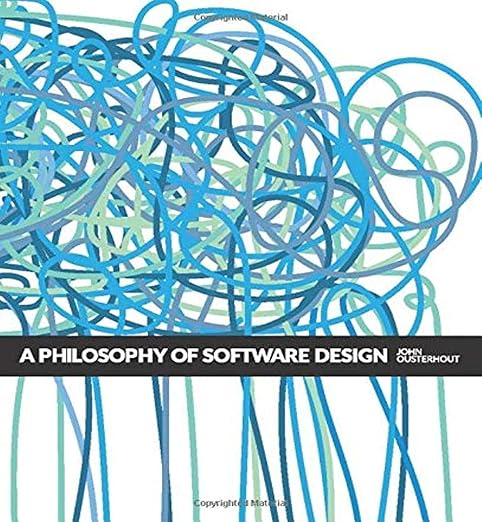

# 複雑さと設計のはなし

古殿直也 2025-05-19

---

<!-- paginate: true -->

## 自己紹介

- 古殿直也 (Furudono Naoya)
  - [@furudono2](https://x.com/furudono2) (Twitter)
- 酒、旅行、ランニングが好き
- ロリポップ・ムームードメイン事業部 事業開発チーム
  - ホスティング環境とユーザを繋げるWebアプリケーションを作っている
  - 13th
- 学生の頃はプログラミング言語意味論の勉強をしていた

---

## 今日の目的

- 設計を上手くやれるようになる動機を得ること
- 輪講会への勧誘
  - すべてのエンジニアが潜在的な対象者だと考えていない
  - 事務的な話（開催形態とか）は扱わない。技術の話をする

---

## 複雑さと設計のはなし

---

### ソフトウェアを簡単に作れるようになって、よりすごいシステムをより安価に作れるようになりたい

システムを作る人たちの願いである

- 個人として
  - 楽しい
  - 実現したいことを実現できるようになる
- 事業会社として
  - ユーザに価値を提供できる
  - 事業の試行錯誤ができる

自由自在にソフトウェアを作れないとき、それは何が原因だろうか

---

### 作るシステムを理解することがソフトウェア開発を律速する

ソフトウェアを書くために必要な能力で支配的なのは、作るシステムがどんなものであるか（つまり設計）を理解する能力（つまり設計する能力）

- ソフトウェアはどんなものを作るのかを明らかにすることが難しい
  - どんなものが欲しいかを表現できれば（つまり設計をアウトプットできれば）作れたも同然
    - 例えば僕は愚かなのでどんな感じに作ればいいかを作りながら考える
- 既存のシステムを拡張する設計のためには、既存のシステムの理解を元に新しい拡張を理解する必要がある
- 全く新しくソフトウェアを作ることはない
  - 例えばCLIツールを作る場合は、コマンドラインインターフェースとかファイルみたいな既存のシステムの上にソフトウェアを作ることになる

高速にするためにできることは何か

---

### 理解する主体が賢くなるか、理解する対象を簡単にするかすればよい

- 主体が賢くなる
  - コードリーディングの能力を高める
  - エディタとかツールを使いこなす
  - 設計の能力を高める
- 対象を簡単にすること
  - インクリメンタルに開発するようにする
  - ドキュメントやテストを書く
  - ソフトウェアをシンプルに保つ

---

### 対象を簡単に保つことがプロダクトの成長をサポートする

- 人間は流動的
  - AIは流動的じゃないのは救い
- プロダクトはいくらでも複雑になれるので、何も工夫しなければ誰も理解できない状態になれる

---

### ソフトウェアをシンプルに保つことにフォーカスする

（箇条書きは再掲）

- 主体が賢くなる
  - コードリーディングの能力を高める
  - エディタとかツールを使いこなす
  - 設計の能力を高める
- 対象を簡単にすること
  - インクリメンタルに開発するようにする
  - ドキュメントやテストを書く
  - **ソフトウェアをシンプルに保つ**

シンプルにすることは複雑さを減らすこと

---

### 複雑さを減らすためのアプローチ

- コードをシンプルに保つこと
  - 名前をちゃんとつける
  - 例外的な処理を減らすこと
- 複雑性をカプセル化すること、モジュラーデザインに基づいた設計をすること
  - インターフェースを簡単にして、システム全体としての複雑さを下げるということ

これだけではピンとこないだろう

---

### これからできること

- 複雑さを理解すること
  - 複雑さとは何を意味するか
  - どんな問題があるのか
  - 設計しているときや作り込んだ後に、いかに不必要な複雑さを認知するか
- 複雑さを減らす手法を身につけること
  - 先人の知恵を勉強すること
  - 開発を通じて練習すること
    - 人のコードをレビューするとき
    - 自分のコードをレビューしてもらったとき

---

### 本に期待できること

一人で読むのも良いし、みんなで読むのも良いでしょう

- **複雑さを理解すること**
  - 複雑さとは何を意味するか
  - どんな問題があるのか
  - 設計しているときや作り込んだ後に、いかに不必要な複雑さを認知するか
- **複雑さを減らす手法を身につけること**
  - **先人の知恵を勉強すること**
  - ~~開発を通じて練習すること~~ : 輪講ではなく普段の開発でやる
    - 人のコードをレビューするとき
    - 自分のコードをレビューしてもらったとき

---

### 参考文献

- [A Philosophy of Software Design](https://amzn.asia/d/eIS4Omp)

