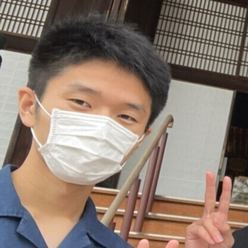

# 複雑さと設計のはなし

古殿直也 2025-05-19

---

<!-- paginate: true -->

## ペパボの紹介

- 色々なWebサービスをやっている

---

## 組織紹介

事業部制をとりつつ、横断でインフラの面倒を見る技術部がある

Goをよく使うのは技術部とロリむー事業部。技術部では運用のためのツールとか、一部ミドルウェアの自作のためにGoを用いている。
ロリムーではWebアプリケーションのバックエンドAPIサーバを実装するためにGoを用いている。

---

## GoGoPepabo

社内のGoコミュニティ。毎週1時間Goのなんでも相談・話題共有をしている。チームを横断して社内のGoユーザがおしゃべりする場。
最近やったGoに関する開発の自慢や、開発の中での困りごと共有、Goの新バージョンリリースなどのトピック共有をしている。

---

## Goで上手にWebアプリケーション開発をもっと上手に回したい

---

## 自己紹介

- 古殿直也 (Furudono Naoya)
  - [@furudono2](https://x.com/furudono2) (Twitter)
- ロリポップ・ムームードメイン事業部 事業開発チーム
  - ホスティング環境とユーザを繋げるWebアプリケーションを作っている
- 学生の頃はプログラミング言語意味論の勉強をしていた
  - 好きな専門書は [EoPL](https://eopl3.com/)
  - 最近は A Philosophy of Software Design を推している

---
